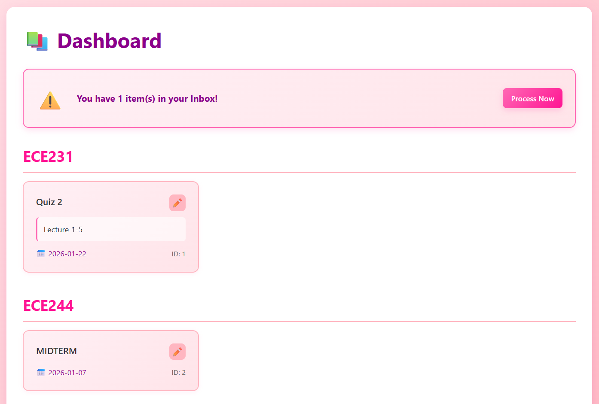
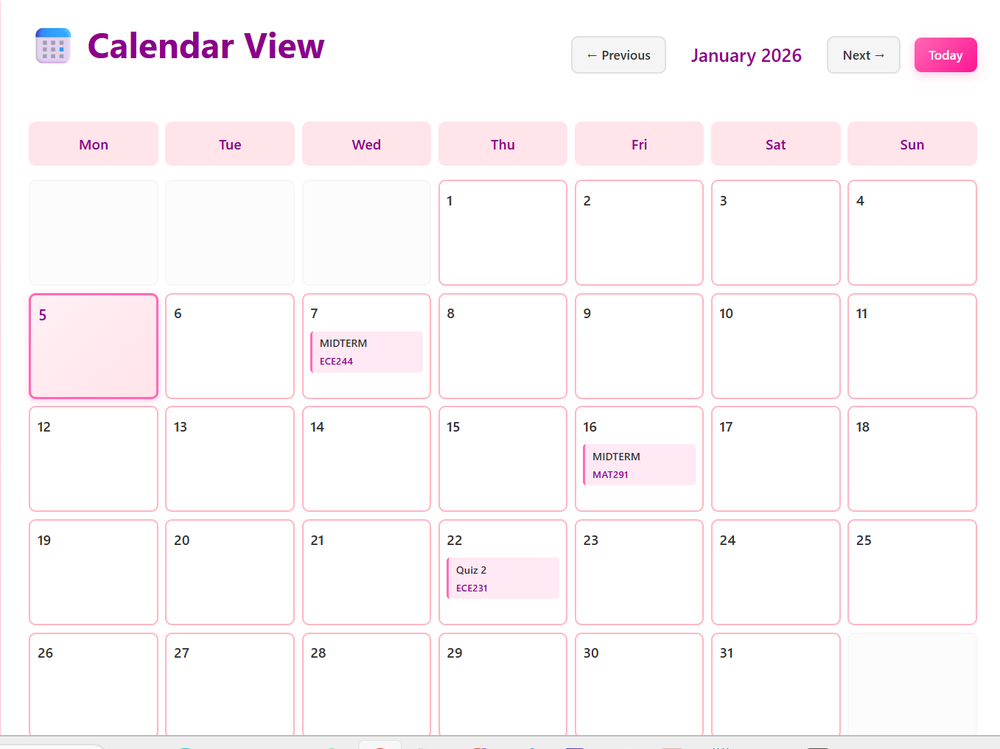
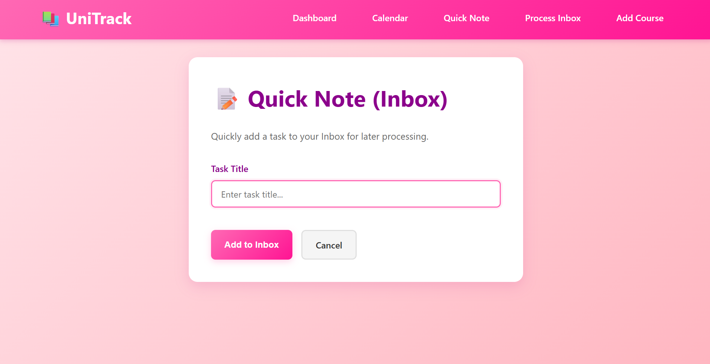
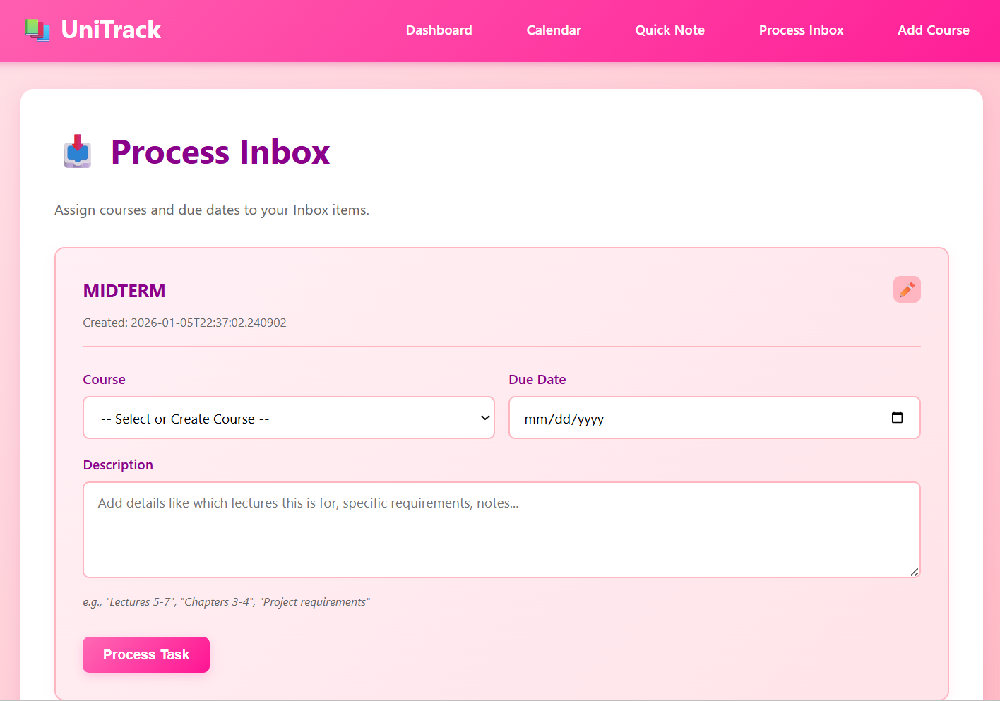

# 📚 UniTrack - Academic & Career Task Manager

A personalized task tracker built for university life and internship applications. A local-hosted web application (full deployment in future) that lets you quickly capture tasks without the hassle, then organize them later when you have time.

## 💭 Why I Built This

As a Computer Engineering student, I needed a task tracker that could handle both my academic workload and internship application deadlines. I tried countless apps and websites, but they all had the same problem: either they were missing features I needed, or they had way too much extra stuff I didn't want.

I'm also a messy person who likes to quickly jot down tasks in the middle of class without having to fill out course titles, due dates, or other details. I just want to dump my thoughts and sort them out later. But most task managers make it really difficult to edit and reorganize tasks after you've created them.

So I built UniTrack - a simple, focused task manager that:
- Lets you quickly add tasks to an Inbox with just a title
- Makes it easy to edit and reorganize tasks later
- Supports both course assignments and internship application tracking
- Keeps things simple without unnecessary features

## 🚧 Current Status

**This project is currently in active development!** Right now it's set up for single-user use, but I'm planning to add:
- Multi-user support so different people can use it
- User authentication and personal task spaces
- Future deployment options for easier access

Stay tuned for updates!

## 📸 App Previews

### 📊 Dashboard & Calendar
| **Course Dashboard** | **Monthly Calendar** |
|:---:|:---:|
|  |  |
| *Group tasks by course context* | *Visual deadline tracking* |

### 📥 The "Inbox" Workflow
| **1. Brain Dump (Quick Note)** | **2. Process & Organize** |
|:---:|:---:|
|  |  |
| *Capture thoughts instantly* | *Assign dates & courses later* |

## ✨ Features

- **📝 Quick Note (Inbox)**: Rapidly capture tasks without worrying about details - perfect for jotting things down in class!
- **📥 Inbox Processing**: Later, when you have time, assign tasks to courses, set due dates, and add descriptions
- **✏️ Easy Editing**: Fix typos, change courses, update dates - editing is simple and straightforward
- **📅 Calendar View**: See all your tasks with due dates in a monthly calendar view
- **📊 Grouped Dashboard**: View tasks organized by course with a clean, visual interface
- **🎯 Course Management**: Create and manage courses/contexts (e.g., "ECE241", "Internships", "Job Applications")
- **💾 SQLite Database**: Relational database with proper foreign key constraints
- **🎨 Beautiful Pink UI**: Modern, responsive design with pink-themed styling
a
## 🛠️ Tech Stack

- **Backend**: Python 3.10+, Flask
- **Database**: SQLite3 (Native Python library)
- **Frontend**: HTML5, CSS3 with custom pink theme
- **Architecture**: Relational database with JOIN queries

## 📋 Prerequisites

- Python 3.10 or higher
- pip (Python package manager)

## 🚀 Installation

1. **Clone or navigate to the project directory:**
   ```bash
   cd UniTrack
   ```

2. **Install dependencies:**
   ```bash
   pip install -r requirements.txt
   ```

## 🎯 Usage

1. **Start the Flask development server:**
   ```bash
   python app.py
   ```

2. **Open your web browser and navigate to:**
   ```
   http://127.0.0.1:5000
   ```

3. **Use the application:**
   - **Dashboard**: View all your tasks grouped by course
   - **Calendar**: See tasks organized by due date in a monthly view
   - **Quick Note**: Add tasks quickly to your Inbox (no details needed!)
   - **Process Inbox**: Later, assign courses, due dates, and descriptions to Inbox items
   - **Edit Tasks**: Easily fix mistakes or update task details anytime
   - **Add Course**: Create new course/context categories (courses, internships, etc.)

## 📁 Project Structure

```
UniTrack/
├── app.py                 # Flask web application
├── database.py            # SQLite database operations
├── requirements.txt       # Python dependencies
├── README.md             # This file
├── templates/            # HTML templates
│   ├── base.html         # Base template with navigation
│   ├── dashboard.html    # Main dashboard view
│   ├── add_quick_note.html
│   ├── process_inbox.html
│   ├── edit_task.html
│   ├── add_course.html
│   └── calendar.html
├── static/               # Static files
│   └── style.css         # Pink-themed CSS styling
└── unitrack.db           # SQLite database (created automatically)
```

## 🗄️ Database Schema

### Courses Table
- `id` (INTEGER PRIMARY KEY)
- `name` (TEXT UNIQUE)

### Tasks Table
- `id` (INTEGER PRIMARY KEY)
- `title` (TEXT)
- `course_id` (INTEGER, FOREIGN KEY, nullable)
- `due_date` (TEXT)
- `status` (TEXT, default: 'Pending')
- `created_at` (TEXT)
- `description` (TEXT, nullable) - For adding details like lecture numbers, requirements, etc.

## 🔒 Security Features

- SQL parameterization (`?` placeholders) to prevent SQL injection
- Foreign key constraints enabled
- Input validation and sanitization

## 🎨 UI/UX Highlights

- **Pink Gradient Theme**: Beautiful pink color scheme throughout
- **Responsive Design**: Works on desktop and mobile devices
- **Smooth Animations**: Hover effects and transitions
- **Clear Visual Hierarchy**: Easy to scan and navigate
- **Flash Messages**: User-friendly feedback for actions

## 📝 Workflow

1. **Quick Capture**: Sitting in class? Just add tasks to Inbox with a title - no other details needed!
2. **Process Later**: When you have time, go through your Inbox and assign courses, due dates, and descriptions
3. **Organize**: View tasks grouped by course on Dashboard, or see them on the Calendar
4. **Edit Anytime**: Made a typo? Need to change a due date? Just click edit and fix it
5. **Manage**: Create new courses/contexts as needed (courses, internships, personal projects, etc.)

## 🔮 Future Plans

- **Multi-user Support**: Allow different people to use the app with their own accounts
- **User Authentication**: Secure login system for personal task spaces
- **Deployment**: Make it accessible online so you can use it from anywhere
- **More Features**: Based on usage and feedback!

## 🐛 Troubleshooting

- **Port already in use**: Change the port in `app.py` (line with `app.run()`)
- **Database errors**: Delete `unitrack.db` to reset the database
- **Import errors**: Ensure all dependencies are installed with `pip install -r requirements.txt`

## 📄 License

This project is open source and available for personal/academic use. Feel free to fork and customize it for your own needs!

