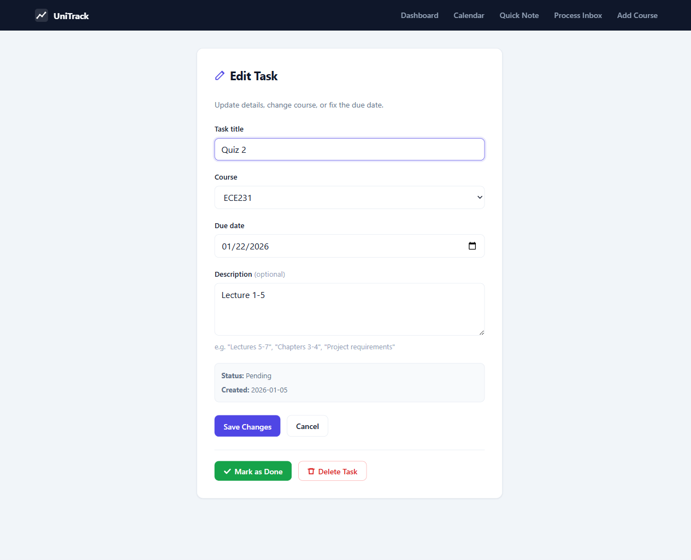
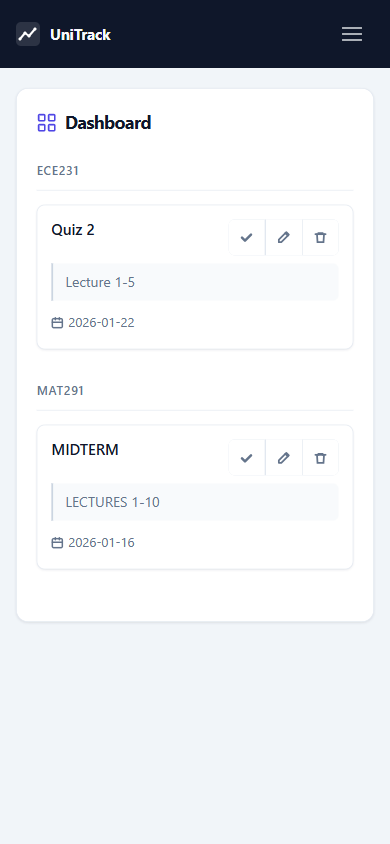

# UniTrack — Academic & Career Task Manager

A focused task tracker built for university life and internship applications. Capture tasks instantly, organize them later — no friction.

## Why I Built This

As a Computer Engineering student I needed something that handled both coursework deadlines and internship application tracking. Every app I tried was either missing features I needed or full of ones I didn't.

The core problem: I want to dump tasks fast in the middle of class — no forms, no dropdowns, no required fields. Then sort them out later when I have time. Most task managers make that painful.

UniTrack solves it with an inbox-first workflow: capture with one field, organize when you're ready.

## Status

Active development. Currently single-user, locally hosted. Planned: multi-user support, authentication, cloud deployment.

## Screenshots

### Dashboard & Calendar

| Dashboard | Calendar |
|:---:|:---:|
|  |  |
| Tasks grouped by course, with inline complete / edit / delete | Monthly view with colour-coded task status |

### Forms & Mobile

| Quick Note | Edit Task | Mobile |
|:---:|:---:|:---:|
|  |  |  |
| One-field inbox capture | Full edit with Mark as Done | Responsive hamburger nav |

## Features

- **Quick Note (Inbox)** — add a task with just a title; no course, date, or description required
- **Inbox Processing** — assign courses, set due dates, and add descriptions when you have time
- **Complete & Delete** — mark tasks done or remove them directly from the dashboard
- **Easy Editing** — change course, due date, or description at any time
- **Calendar View** — monthly calendar showing all tasks with due dates, colour-coded by status (Pending / Inbox / Done)
- **Course Dashboard** — tasks grouped by course with a clean card layout
- **Course Management** — create contexts like ECE241, Internships, or Personal Projects
- **CLI Interface** — `python cli.py` for a terminal-based workflow using the same database
- **SQLite backend** — local database with foreign key constraints and parameterized queries

## Tech Stack

- **Backend** — Python 3.10+, Flask
- **Database** — SQLite3 (stdlib)
- **Frontend** — HTML5, vanilla CSS3 (Slate Pro theme — no framework)
- **CLI** — Python + Rich library

## Prerequisites

- Python 3.10 or higher
- pip

## Installation

```bash
# Clone the repo
git clone https://github.com/dareen-nasreldin/UniTrack.git
cd UniTrack

# Install dependencies
pip install -r requirements.txt
```

## Running

```bash
python run.py
```

Open [http://127.0.0.1:5000](http://127.0.0.1:5000) in your browser.

For the terminal interface:

```bash
python cli.py
```

## Project Structure

```
UniTrack/
├── app/
│   ├── __init__.py        # App factory (create_app)
│   ├── config.py          # Dev / Production config classes
│   ├── database.py        # All SQLite operations
│   └── routes.py          # All Flask routes
├── static/
│   └── css/style.css      # Slate Pro theme
├── templates/
│   ├── base.html          # Navbar, flash messages, skip link
│   ├── dashboard.html     # Tasks grouped by course
│   ├── calendar.html      # Monthly calendar view
│   ├── _task_card.html    # Shared task card partial
│   ├── tasks/
│   │   ├── add_quick_note.html
│   │   ├── process_inbox.html
│   │   └── edit_task.html
│   └── courses/
│       └── add_course.html
├── cli.py                 # Terminal interface (Rich)
├── run.py                 # Dev entry point
├── wsgi.py                # Production entry point (gunicorn)
├── .env.example           # Environment variable template
├── requirements.txt
└── unitrack.db            # SQLite database (auto-created)
```

## Database Schema

**courses** — `id`, `name` (UNIQUE)

**tasks** — `id`, `title`, `course_id` (FK → courses, nullable), `due_date` (TEXT), `status` (Inbox | Pending | Done), `created_at`, `description`

## Workflow

1. **Capture** — in class, hit Quick Note and type a title. Done.
2. **Process** — later, open Process Inbox and assign courses, dates, and descriptions.
3. **Track** — Dashboard shows Pending tasks by course. Calendar shows everything by date.
4. **Complete or delete** — check off tasks when done, delete ones that no longer apply.

## Security

- Parameterized SQL queries throughout (no injection risk)
- Foreign key constraints enabled
- Secret key loaded from environment variable (`SECRET_KEY` in `.env`)

## Future Plans

- Multi-user support and authentication
- Cloud deployment (Railway / Render)
- Task priorities
- Search and filtering
- Course management page (rename, delete)

## Troubleshooting

| Problem | Fix |
|---|---|
| Port 5000 in use | Set `PORT=5001` in `.env` |
| Database errors | Delete `unitrack.db` to reset |
| Missing dependencies | `pip install -r requirements.txt` |
| Secret key warning | Copy `.env.example` to `.env` and set a real key |

## License  

Open source — personal and academic use. Fork and adapt freely.
